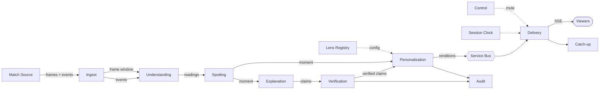

# Architecture

**Style: event-driven streaming pipeline** — pipes and filters over an unbounded stream, with event sourcing at the base, fan-out at personalization, stateful edge delivery, and agentic middle stages.

Explicitly **not** n-tier/layered, not microservices, not request/response, not batch/ETL, not pub/sub. Saying which it is not matters: the obvious instinct is to build this as layers, and layers ship nothing observable for two weeks.

---

## The 13 components

Each responsibility is one sentence with no "and" in it. If a component's description needs an "and", it is doing two jobs and should be split.

| # | Component | Responsibility |
|---|---|---|
| 1 | **Match Source** | Produces a deterministic stream of frames and events from a seed |
| 2 | **Ingest** | Holds the recent frame window in memory and enforces the frame access boundary |
| 3 | **Understanding** | Turns the raw stream into derived measures — possessions, shot quality, signal readings |
| 4 | **Spotting** | Decides which measured changes are worth saying something about |
| 5 | **Explanation** | Produces structured claims for a moment from a log frozen at that clock |
| 6 | **Verification** | Checks each claim against the untouched record and returns a verdict |
| 7 | **Personalization** | Selects and renders the surviving claim set for one lens |
| 8 | **Catch-up** | Summarises what a lens would have shown before a viewer joined |
| 9 | **Delivery** | Releases each rendition to a session when that session's clock reaches it |
| 10 | **Session Clock** | Tracks where each viewer is in the match |
| 11 | **Lens Registry** | Serves lens configuration as data |
| 12 | **Control** | Applies producer interventions to subsequent cards |
| 13 | **Audit** | Records what was said and how it held up |

---

## How data moves

**The twelve steps in words:**

1. Match Source emits a frame at the configured rate and events as they occur, both carrying `seq` and `clock_ms`.
2. Ingest accepts them, keeps frames in a memory window, and persists events.
3. Understanding derives possessions and shot quality from events, and line height and compactness from the frame window.
4. Understanding emits `SignalReading`s on a rolling cadence, each carrying `baseline`, `z_match`, `z_prior`, `confidence` and `epoch_id`.
5. Spotting compares readings against thresholds, scores importance, applies cooldown and duplicate suppression, and emits a `Moment` citing what fired it.
6. Explanation takes the moment, reads a log **frozen at that moment's clock**, and emits `Claim`s — never prose.
7. Verification runs the six checks per claim, recomputes values independently, and persists a `Verification` per claim. Fails closed.
8. Personalization takes the moment plus its passing claims. For each lens: dispatch on `scope`, apply `importance_threshold` and `max_cards_per_10min`, filter by `allowed_claim_types`, then render.
9. Personalization emits a `Rendition` per lens — **including `suppressed=true` ones**, which are records, not absences.
10. Renditions go onto the broker, partitioned by `match_id`.
11. Delivery holds each rendition in a per-session queue and releases it when `display_at_clock <= match_clock_now - stream_offset_ms` for that session.
12. The viewer's browser receives it over SSE and renders a card.

---

## Data ownership — single writer per entity

Nine components touch storage. Without a rule this becomes an integration database, where every component reads and writes every table and nothing can change safely.

**The rule: exactly one component writes each entity.** Everyone else receives it on the stream.

| Entity | Written by |
|---|---|
| `Match`, `Team`, `Player`, `Frame`, `Event` | Match Source (via Ingest) |
| `Possession`, `ShotValue`, `SignalReading`, `Epoch` | Understanding |
| `Moment` | Spotting |
| `Claim` | Explanation |
| `Verification` | Verification |
| `Rendition`, `OverlayPacket` | Personalization |
| `ViewerSession` | Delivery |
| `ProducerAction` | Control |
| `Lens`, `SignalPrior`, `MatchArchetype` | Control / offline scripts |

**Most "reads" are not storage reads.** Data arrives on the stream. There are only three legitimate reasons to read from storage:

1. **The frozen log** — Explanation reading events strictly before a clock.
2. **History** — Catch-up and recap reading moments and renditions for a window.
3. **Configuration** — anything reading the Lens Registry or priors.

Anything else that wants a storage read is probably a missing stream message. Stop and ask.

---

## Boundaries

- **Frames stop at Understanding.** Nothing downstream of Understanding may read a `Frame`. This is the boundary with a test on it.
- **The record / editorial line sits between Understanding and Spotting.** Everything upstream is a faithful record; everything downstream is an opinion.
- **Verification sits between Explanation and Personalization** so that no unverified claim can reach a renderer.
- **Lens config is read, never written, by Personalization.**

---

## Deployment

Thirteen components, **two deployable units** plus an optional function. The split falls on a real boundary: the slow agentic path and the fast session-oriented path have genuinely different scaling characteristics.

| Unit | Components | Shape |
|---|---|---|
| **Pipeline app** | Match Source, Ingest, Understanding, Spotting, Explanation, Verification, Personalization, Catch-up, Lens Registry | CPU and model bound, bursty |
| **Delivery app** | Delivery, Session Clock, Control | Connection bound, stateful per session |
| **Audit function** | Audit | Event-triggered, post-match, nobody waits for it |

One repo, one image, two entrypoints (`apps/pipeline.py`, `apps/delivery.py`). Everything else is an in-process module.

Python's GIL is a real consideration when CPU work shares a process with I/O. The two-container split already solves it: the pipeline container does the CPU-heavy work, the delivery container does nothing but I/O and timing, so they never share a process.

---

## Scaling, for the pitch only

Not build work. One match, one pipeline, one container.

- **One pipeline worker per match**, partitioned by `match_id` — nearly all pipeline state is per-match (ring buffers, rolling windows, baselines, epochs, suppression lists) and no two matches share anything.
- **Renditions are per match × lens, not per viewer.** Twenty matches × three lenses = 60 streams, whether ten people watch or ten million. A viewer costs a connection, not a computation.
- **The real cost driver is Explanation**, which scales with matches × moments and runs whether anyone is watching.

The full version lives in the Notion Infrastructure page under "Scaling in production".

---

## Observability

One trace per moment, spanning spotter → explainer → verifier → personalizer, with `moment_id` as a trace attribute and timings on each span.

A screenshot of that waterfall is evidence of orchestration that no amount of prose achieves: it shows the agents are genuinely separate, genuinely sequential, and genuinely handing work to each other.
