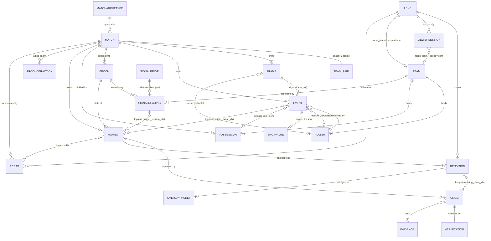

# Relationships and cardinalities

`docs/DATA-MODEL.md` describes what each entity holds. This describes how they connect.

Several of these are not documentation — they are where an invariant from `CLAUDE.md` is enforced structurally rather than by a runtime check. Those are marked **⚠️ load-bearing**.

---

## The ERD

`TEAM_PAIR` and `EVIDENCE` are notation conveniences, not entities. `TEAM_PAIR` stands for the exactly-two constraint; `EVIDENCE` stands for the polymorphic union below.

---

## Full table

Read `A — B` as "one A relates to this many B".

### A · Match record

| From | To | Cardinality | Notes |
|---|---|---|---|
| `Match` | `Team` | **exactly 2** | ⚠️ Not "many". Every signal is per-team; a third team silently breaks every baseline. Add a validator. |
| `Team` | `Player` | 1..* (≈14–18) | 11 starters plus substitutes |
| `Match` | `Frame` | 1..* (≈10,800 at 2 Hz) | Memory only, never a row per frame |
| `Match` | `Event` | 1..* (≈1,800) | Every action, not just interesting ones |
| `Frame` | `Event` | 0..* | A frame may align to several events or none |
| `Event` | `Frame` | **exactly 1** | Via `frame_ref`. Mandatory — positional context must always be recoverable |
| `Event` | `Player` (`player`) | 1 | Nullable only if you model period boundaries as events |
| `Event` | `Player` (`receiver`) | 0..1 | Passes only |
| `Event` | `Player` (`player_on`) | 0..1 | Substitutions only. `player` is the one coming off (D16) |
| `Player` | `Event` (`substitution`, `red_card`) | 0..* | ⚠️ **How roster state is known.** `on_clock_ms` / `off_clock_ms` are not fields — who was on the pitch at a clock is derived from `is_starter` plus these events, so the verifier's entity check is reproducible (D16) |
| `Frame` | `Player` (`carrier`) | 0..1 | Null when the ball is loose or in flight |
| `Frame` | `Player` (`players`) | exactly 22 | Fewer after a sending-off — do not hardcode 22 |

### B · Derived understanding

| From | To | Cardinality | Notes |
|---|---|---|---|
| `Match` | `Possession` | 1..* | |
| `Possession` | `Team` | exactly 1 | |
| `Possession` | `Event` | 1..* | Via `event_ids` |
| `Event` | `Possession` | **0..1** | ⚠️ **Zero is legal.** Events during stopped play belong to no possession. Modelling this as mandatory then defaulting it is how possession-control readings get quietly corrupted. |
| `Event` | `ShotValue` | **0..1** | Optional 1:1, shots only |
| `ShotValue` | `Event` | exactly 1 | ⚠️ A separate entity rather than three fields on `Event` **because `Event` is append-only**. Shot quality carries a `model_version`; recalibrating emits a new `ShotValue` and must never edit the event. |
| `Match` | `Epoch` | 1..* (min 2) | At least first and second half, since `half_time` is a trigger |
| `Match` | `SignalReading` | 1..* | 5 signals × 2 teams × rolling cadence |
| `SignalReading` | `Team` | exactly 1 | Every reading describes one side |
| `SignalReading` | `Epoch` | **exactly 1** | Unambiguous by construction: **D15** clamps a window so it can never cross an epoch boundary, so `epoch_id` is always the current epoch at the reading's clock. No overlap maths, no majority rule. |
| `SignalPrior` | `SignalReading` | 1..* | By `signal`, not by ID. A prior is only valid for the `generator_version` that made it |

### C · Editorial output

| From | To | Cardinality | Notes |
|---|---|---|---|
| `Match` | `Moment` | 0..* (≈30–60) | |
| `Moment` | `Epoch` | exactly 1 | Game state when it fired |
| `Moment` | subject | exactly 1 | ⚠️ **Polymorphic** — a `Team` or a `Player`. Use a discriminated union. A bare ID string means the verifier's entity check cannot know whether to derive an on-pitch window for a player or skip the check for a team. |
| `SignalReading` | `Moment` | **many-to-many** | One reading can contribute to more than one moment; one moment cites several readings |
| `Event` | `Moment` | many-to-many | Same shape, via `trigger_event_ids` |
| `Moment` | `Claim` | **0..\*** | Kehinde's example, with one correction: zero is legal. A moment whose claims are all dropped produces **no renditions and is never shown** — but the `Moment` row stays, because why it fired and why nothing shipped is the audit trail. |
| `Claim` | `Verification` | **exactly 1, mandatory** | ⚠️ Not 0..1. **A claim with no verification row is treated as failed, not unchecked.** This is "fails closed" at the schema level. |
| `Claim` | evidence | **1..\*, mandatory** | ⚠️ **Polymorphic** — `Event`, `SignalReading` or `Run`. The cardinality *is* invariant 5: a claim with zero evidence IDs cannot be constructed, so it can never be softened and passed through. Only `interpretive` claims additionally require at least one `SignalReading` among them. |
| `Moment` | `Rendition` | **exactly N, where N = active lens count** | ⚠️ **The most important cardinality in the model.** Not 0..N. Every moment gets a rendition for every lens, with `suppressed=true` where the lens chose silence. Invariant 11 as a cardinality. The storage tier confirms it: 60 × 3 ≈ 180, matching the "~200 small and valuable" estimate. If this were 0..N, silence would be an absence and the product's central proof would be unobservable. |
| `Rendition` | `Lens` | exactly 1 | |
| `Rendition` | `Claim` | 0..* | Via `surviving_claim_ids`, a subset of the moment's **passing** claims. Empty when suppressed. Each rendition is verified against its own surviving set, never the moment's full set. |
| `Rendition` | `OverlayPacket` | 0..1 | None for a suppressed rendition |
| `Recap` | `Lens` | exactly 1 | T3 — may not be built |
| `Recap` | `Moment` | 1..* | Keeps it traceable to verified claims |

### D · Delivery and configuration

| From | To | Cardinality | Notes |
|---|---|---|---|
| `Lens` | `ViewerSession` | 0..* | |
| `ViewerSession` | `Lens` | exactly 1 | |
| `Lens` | `Team` (`focus_team`) | **0..1, conditional** | ⚠️ Required **iff** `scope == 'team'`, null otherwise. Conditional requiredness, not a plain nullable — validate it on the model. |
| `Lens` | `Player` (`focus_player`) | 0..1, conditional | Required iff `scope == 'player'`. Unused in v1. |
| `ViewerSession` | `Team` (`focus_team`) | 0..1, conditional | Same rule, mirrored from the lens |
| `ProducerAction` | target | exactly 1 | ⚠️ **Polymorphic** — a `Moment`, `Rendition` or `Lens`. Discriminated union again. |
| `Match` | `ProducerAction` | 0..* | |

### E · Reference data

| Entity | Key | Notes |
|---|---|---|
| `SignalPrior` | composite: (`signal`, `generator_version`) | ⚠️ **No surrogate ID.** One row per signal per generator version. Not per match. |
| `MatchArchetype` | `archetype_id` | 1 archetype → 0..* matches |
| `LexiconEntry` | composite: (`term`, `language`, `lens`) | ⚠️ No surrogate ID. T3 — may not be built. |

---

## Three polymorphic relationships

These are the ones most likely to be modelled as bare strings and cause trouble three weeks later.

| Field | Points at | Why it must be discriminated |
|---|---|---|
| `Moment.subject` | `Team` \| `Player` | The verifier's entity check must know whether to derive an on-pitch window from the log (player) or skip the check (team). It also decides which lenses *could* care, so scope dispatch depends on it. |
| `Claim.evidence_ids` | `Event` \| `SignalReading` \| `Run` | The verifier recomputes a value from the evidence. It cannot recompute without knowing the kind. |
| `ProducerAction.target_id` | `Moment` \| `Rendition` \| `Lens` | Muting a lens, suppressing a rendition and pinning a moment are different operations. |

Suggested shape: a small `Ref` type carrying `kind` and `id`, used everywhere. One type, three uses, and the verifier gets a single dispatch point.

---

## Conditionally required fields

Three fields are not plain nullables — they are required under a condition. Validate the condition on the model; a nullable field with a convention about when it is set will drift.

| Field | Required iff | Null otherwise |
|---|---|---|
| `Lens.focus_team` / `ViewerSession.focus_team` | `scope == 'team'` | yes |
| `Lens.focus_player` / `ViewerSession.focus_player` | `scope == 'player'` | yes — unused in v1 |
| `Rendition.suppression_reason` | `suppressed == true` | yes |

---

## Open questions this surfaced

### O7 · Does `Rendition` need a `suppression_reason`? — RESOLVED 9 Oct

**Yes.** Added, with a seven-value `SuppressionReason` enum and a declared evaluation order. See `docs/DATA-MODEL.md` under `Rendition`, and D14 in `docs/DECISIONS.md`.

### O8 · Which epoch does a straddling reading belong to? — RESOLVED 9 Oct

**Dissolved, not answered.** A signal window is now clamped so it can never cross an epoch boundary, so `epoch_id` is unambiguous by construction. See **D15** in `docs/DECISIONS.md`. This also resolved O2.

The original question, kept for context

`SignalReading` → `Epoch` is exactly 1, but a rolling window can span a structural break. O2 proposes emitting such a reading with low `confidence`, which handles trust but not identity — the row still needs one `epoch_id`.

Options: the epoch at the reading's `clock_ms` (simple, slightly wrong), the epoch holding most of the window (more correct, needs overlap maths), or splitting the reading in two (most correct, changes the cardinality to many).

